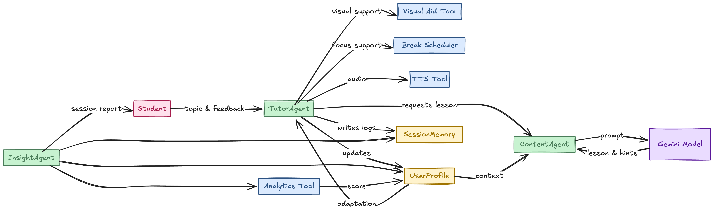

# Kindred — Adaptive Learning Companion
Kindred is an experimental multi-agent learning system that adapts educational content in real time based on each student’s understanding, preferences, and pace. The project explores how tool-augmented AI agents and persistent memory can support students who learn differently, offering a flexible alternative to one-size-fits-all teaching. Kindred treats learning as a dialogue rather than a lecture. It listens, adjusts, and responds with clarity and encouragement instead of simply delivering information.

## Key Features
- Multi-agent architecture (Tutor, Content, Insight)
- Adaptive lesson generation powered by Gemini
- Real-time feedback with hints and pacing adjustments
- Persistent student profiles and session memory
- Automatically generated progress summaries

## What It Does
Kindred runs learning sessions step by step, adjusts explanations whenever confusion appears, and builds a profile of what type of instruction works best for a learner. At the end of a session, it generates a summary of progress and challenge areas for review.

## Quick Start
Install dependencies:
```bash
pip install -r requirements.txt
```

Set up the environment:
```
Duplicate .env.example, rename it to .env, and add your Gemini API key.
```

Run a session:
```python
python main.py --student student001 --name Alex --topic "Why do seasons change?"
```

Example interaction:
```python
Tutor: The Earth’s tilt causes different parts of the planet to receive different amounts of sunlight during the year. Did that make sense? (yes / no)
Student: no
Tutor: Picture a flashlight shining on a tilted ball — some parts get more light than others.
```

Session reports and profiles are written to:
```
/reports
```

## Project Structure
```bash
kindred/
  assets/                 # images, diagrams, static resources
  agents/                 # TutorAgent, ContentAgent, InsightAgent logic
  tools/                  # visual aids, break scheduling, TTS, analytics
  memory/                 # student profile and session history
  reports/                # auto-generated session reports
  main.py                 # entry point for interactive sessions
```

## System Architecture


## License
MIT License
